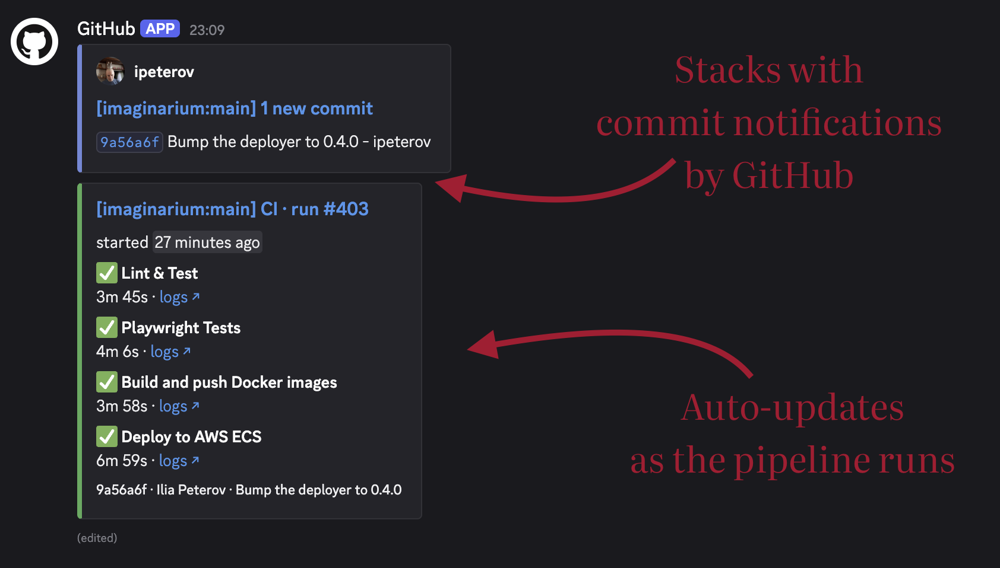

# discord-notify-action

A GitHub Action that posts a live-updating Discord card showing the status of jobs in the current workflow run.

The card is designed to complement GitHub's own `/github` integration commit
notifications — it deliberately doesn't duplicate the avatar, branch, or commit
metadata GitHub already provides, and matches the bot username so the two
messages group together in Discord.



## Usage

Add a job to your workflow that runs in parallel with the others:

```yaml
jobs:
  notify-discord:
    name: Notify Discord
    if: github.event_name != 'pull_request'
    runs-on: ubuntu-latest
    permissions:
      actions: read
      contents: read
    steps:
      - uses: ipeterov/discord-notify-action@v1
        with:
          webhook: ${{ secrets.DISCORD_WEBHOOK }}
          jobs: |
            - linters
            - tests
            - build
            - deploy

  linters:
    # ...
  tests:
    # ...
  build:
    # ...
  deploy:
    # ...
```

The action polls the GitHub Actions API every few seconds and PATCHes a single
Discord webhook message until every watched job reaches a terminal state.

## Inputs

| Input           | Required | Description |
|-----------------|----------|-------------|
| `webhook`       | yes      | Discord webhook URL. Set this from a secret. |
| `jobs`          | yes      | Job ids to watch, in the same form `needs:` accepts. Accepts a scalar, a flow list, or a block list. |
| `poll_interval` | no       | How often to poll the GitHub API, in seconds. Defaults to `5`. Must be at least `1` — polling faster risks rate limits and buys little. |
| `build_number`  | no       | Your own build number to show in the card title (e.g. `build #6128`). When unset, the title uses GitHub's run number (`run #<run_number>`). |
| `github-token`  | no       | Token used to read the run and its jobs. Defaults to the job's `github.token`. |

The `jobs` input takes any of these:

```yaml
jobs: linters
jobs: [linters, tests, deploy]
jobs: |
  - linters
  - tests
  - deploy
```

Job ids must match the YAML keys under `jobs:` in your workflow file — the same
strings you'd use in `needs:`.

## Required permissions

The notify job needs:

- `actions: read` — to poll the run and its jobs.
- `contents: read` — to fetch the workflow file and map your `jobs:` ids
  to the API's display names.

The default `GITHUB_TOKEN` is sufficient.

## Reruns

The notify job exits non-zero if any watched job ends in `failure` or
`timed_out`. This makes "Re-run failed jobs" include the notifier alongside
the jobs you're re-running, so the card keeps updating on the new attempt.

Each attempt posts a new Discord message; from attempt 2 onward the title
includes `(attempt N)` so the cards are easy to tell apart.

## What the card shows

Each watched job gets a row with:

- A status emoji and the job name, linked to its logs.
- A live elapsed timer while the job runs, frozen to its total duration once it
  finishes, alongside the conclusion word (`success`, `failed`, `skipped`,
  `cancelled`, `timed out`, …).
- For a running or failed job, the step currently in flight (or the step that
  broke), with a `step/total` counter — so the card says *what* is happening,
  not just that something is.

The card title shows the run (or `build_number`) and attempt; while anything is
running the description shows a native `started …` relative time, which Discord
ticks on its own, then freezes to `ran for <duration>` once every watched job is
terminal.

## Matrix jobs

Matrix jobs and reusable-workflow jobs are collapsed into one row per job id,
with a `N/M done` summary (and `, K failed` when some fail). Their runtime ticks
live across the whole matrix and freezes at earliest-start → latest-finish. The
card stays compact regardless of how many combinations the matrix expands into.

## License

MIT
